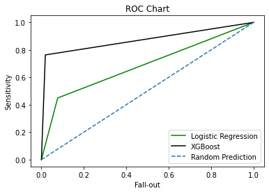

# Credit-Risk-Modelling
This project aims to predict if a borrower is at risk of default using logistic regression and XGBoost 

## Methodology
Logistic Regression and XGBoost is used to train the cleaned dataset to predict the probability of default. Several features are used for the algorithms with the loan status as the label. The models were evaluated using the F-1 score for loan defaults and ROC chart. 
F1 score incorporates the precision and sensitivity of the model to predict default and ROC illustrates the best model with higher lift has better sensitivity and lower false positive rate (fall-out)

## Results 
The XGBoost model with a probability threshold of 0.4 is evaluated to be the best model based on the F-1 scores and ROC plot.

## Data
The loan data has 11 features and a loan status label which includes application information like loan grade and behavioral data of the borrower.
